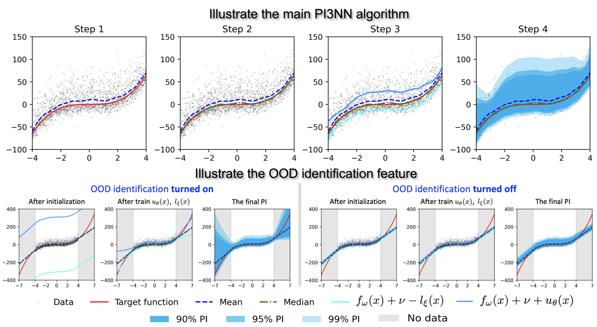

# PI3NN: Out-of-distribution-aware prediction intervals from three neural networks
<br/>


We propose a novel prediction interval method to learn the prediction mean values, upper and lower bounds of the prediction intervals from three independently trained neural networks using only standard mean squared error (MSE) loss, for uncertainty quantification in regression tasks. We aim to address three major issues with the state-of-the-art PI methods. First, existing PI methods require retraining of neural networks (NNs) for every given confidence level and suffer from the crossing issue in calculating multiple PIs. Second, they usually rely on customized loss functions with extra sensitive hyperparameters for which fine tuning is required to achieve a well-calibrated PI. Third, they usually underestimate uncertainties of out-of-distribution (OOD) samples leading to over-confident PIs. Our PI3NN method calculates PIs from linear combinations of three NNs, each of which is independently trained using the standard mean squared error loss. The coefficients of the linear combinations are computed using root-finding algorithms to ensure tight PIs for a given confidence level. We theoretically prove that PI3NN can calculate PIs for a series of confidence levels without retraining NNs and it completely avoids the crossing issue. Additionally, PI3NN does not introduce any unusual hyperparameters resulting in a stable performance. Furthermore, we address OOD identification challenge by introducing an initialization scheme which provides reasonably larger PIs of the OOD samples than those of the in-distribution samples. Benchmark and real-world experiments show that our method outperforms several state-of-the-art approaches with respect to predictive uncertainty quality, robustness, and OOD samples identification.
<br/><br/>

### An illustrative example

We use a one-dimensional non-Gaussian cubic regression dataset to illustrate PI3NN. We train models on  within [-4,4] and test them on [-7,7]. The noise  is defined by , where ,  for  and  for .
Top panels of figure below illustrate the four steps of the PI3NN algorithm. After Step 1-3 we finish the NNs training and obtain  and . Then for a given series of confidence levels , we use root-finding technique to calculate the corresponding  and  in Step 4 and obtain the associated  PIs. The top-right Figure shows the 90\%, 95\% and 99\% PIs. In calculation of the series of PIs for the multiple confidence levels, PI3NN only trains the three NNs once and the resulted PIs have no "crossing issue". Bottom panels of the figure below demonstrate the effectiveness of PI3NN's OOD identification capability and illustrate that it is our bias initialization scheme enables PI3NN to identify the OOD regions and reasonably quantify their uncertainty.

<p align="center"></p>

<p align="left">
Top panels illustrate the four steps of our PI3NN algorithm. Bottom panels illustrate the effectiveness of the OOD identification feature. As shown in bottom left, when turning on the OOD identification feature by initializing the bias of the output layer of  and  to a large value, PI3NN can accurately identify the OOD regions   by giving them increasingly large PIs as their distance from the training data gets large.In bottom right, if we turn off the OOD identification by using the default initialization, PI3NN will not identify the OOD regions by giving them a narrow uncertainty bound.
</p><br/>


### Prerequisite
To run the code, make sure these packages are installed in addition to the commonly used Numpy, Pandas, Matplotlib, sklearn, etc. <br/>
--- python (>=3.8, version 3.8.3 is used in this study) <br/>
--- TensorFlow (>=2.0, version 2.4.1 is used in this study) <br/>
--- Hyperopt (=0.2.5, used for hyper-parameters tuning) <br/><br/>


### Run the code
The examples are based on the nine UCI datasets (BostonHousing, Concrete, energy-efficiency, kin8nm, wine-quality, yacht, naval, powerplant, protein). We used sklearn to conduct 90%/10% train/test split, and further obtained 10% of the validation data from those 90% of training data. The target quantile is set to 0.95. After networks training and predicted intervals optimization, the Prediction Interval Coverage Probability (PICP) and the Mean Prediction Interval Width (MPIW) for train, validation and test data will be calculated to estimate the quality of PIs. In addtion, the MSE, RMSE and R2 will be evaluated for the testing data.

We provide manual and automatic mode for running the code. 
#### Manual mode
For the manual mode, you need to assign various hyper-parmaters:
```python
configs['seed'] = 10                # general random seed
configs['num_neurons_mean'] = [50]  # hidden layer(s) for the 'MEAN' network. It can be multiple layers like [50, 50]
configs['num_neurons_up'] = [50]    # hidden layer(s) for the 'UP' network
configs['num_neurons_down'] = [50]  # hidden layer(s) for the 'DOWN' network
configs['Max_iter'] = 5000          # maximum epochs
configs['lr'] = [0.02, 0.02, 0.02]  # learning rate
configs['optimizers'] = ['Adam', 'Adam', 'Adam'] # optimizers for 3 networks, which can be 'SGD' 
configs['exponential_decay'] = True 
configs['decay_steps'] = 3000
configs['decay_rate'] = 0.9
configs['early_stop'] = True
configs['early_stop_start_iter'] = 100
configs['wait_patience'] = 300
configs['batch_training'] = False 
configs['batch_size'] = 256
configs['batch_shuffle'] = True
configs['batch_shuffle_buffer'] = 1024 
```
The command for running manual mode:
```python
python main_PI3NN.py --data boston --mode manual --quantile 0.95
```
Note: The data name for '--data' input for other 8 datasets are 'concrete', 'energy', 'kin8nm', 'wine', 'yacht', 'naval', 'powerplant', 'protein'

#### Automatic mode
The auto mode optimize the abovementioned hyper-parameters by utilizing the 'Hyperopt' package (https://hyperopt.github.io/) to meet the desired validation PICP value against the prescribed quantile. The program will re-run the training using the optimized parameters after tuning. The command for running auto mode is:
```python
python main_PI3NN.py --data boston --mode auto --quantile 0.95
```

#### Multiple PIs
Multiple PIs can be obtained based on multiple input quantiles without re-train the networks. You need to add a list of target quantiles to the inputs by adding:
```python
configs['quantile_list] = np.arange(0.05, 1.00, 0.05) # 0.05-0.95
```
after the data loading section in the 'main_PI3NN.py' file. Simply comment out this line in order to run single quantile estimation. Multiple PIs prediction works for manual mode only at this point. <br/><br/>


## References

[1] Siyan Liu, Pei Zhang, Dan Lu, and Guannan Zhang. "PI3NN: Out-of-distribution-aware Prediction Intervals from Three Neural Networks." International Conference on Learning Representations, 2022. https://openreview.net/forum?id=NoB8YgRuoFU

[2] Siyan Liu, Pei Zhang, Dan Lu, and Guannan Zhang. "PI3NN: Out-of-distribution-aware prediction intervals from three neural networks." arXiv preprint arXiv:2108.02327 (2021). https://arxiv.org/abs/2108.02327

[3] Pei Zhang, Siyan Liu, Dan Lu, Guannan Zhang, and Ramanan Sankaran. "A prediction interval method for uncertainty quantification of regression models". ICLR 2021 SimDL Workshop. https://simdl.github.io/files/52.pdf

[4] Pei Zhang, Siyan Liu, Dan Lu, Ramanan Sankaran, and Guannan Zhang. "An out-of-distribution-aware autoencoder model for reduced chemical kinetics." Discrete Continuous Dynamical Systems - S 15(4)(2022)913-930 https://www.aimsciences.org/article/doi/10.3934/dcdss.2021138 


Have fun!

